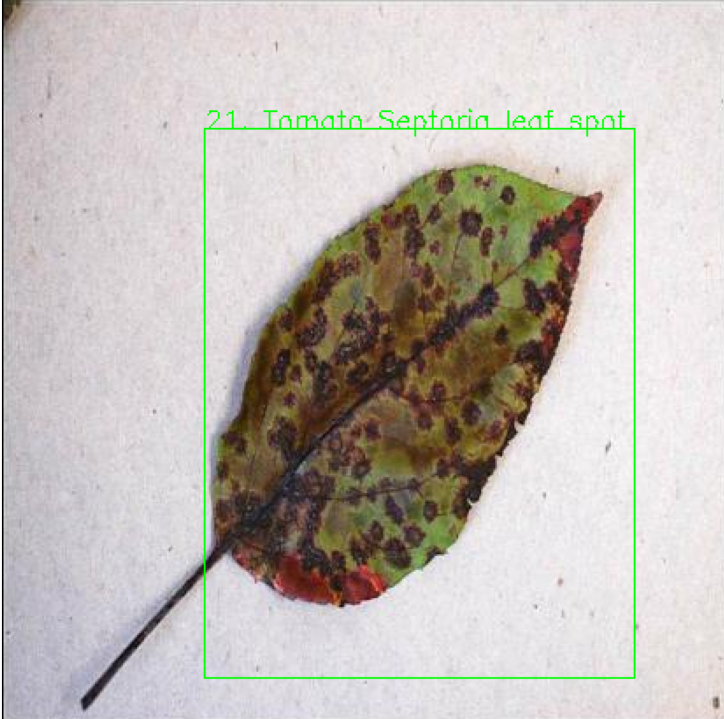

# Plant Disease Detection
Computer Vision project for plant disease detection using PyTorch.

Goal: Recognise plant disease and provide alert or instruction to drone/ robot.  

## Installation

`pip install -r requirements.txt `

## Quick Run
1. Prepare dataset

   Obtain [PlantDoc](https://public.roboflow.ai/object-detection/plantdoc) dataset.

   Ensure your dataset is divided into test and train. 

2. Train model

   Run `python train.py`

3. Model inference

   Run `python infer.py`

## Built with
- PyTorch

### To do
- Adding evaluation function

## Resources

- https://public.roboflow.ai/object-detection/plantdoc
- https://pytorch.org/tutorials/intermediate/torchvision_tutorial.html
- https://medium.com/fullstackai/how-to-train-an-object-detector-with-your-own-coco-dataset-in-pytorch-319e7090da5